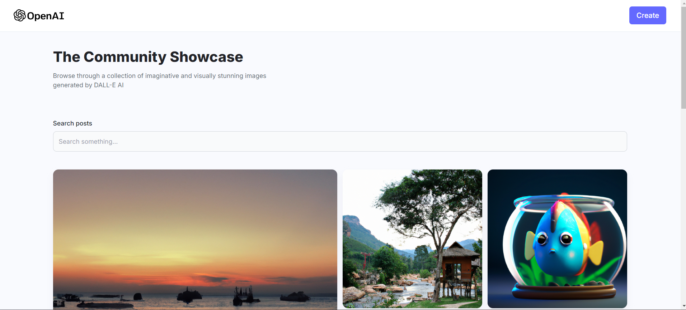
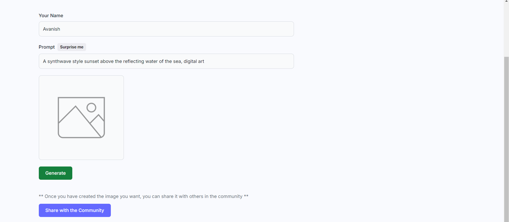

# Build and Deploy a Full Stack MERN AI Image Generation App: MidJourney & DALL E Clone

## Demo Link
[Live website Link](https://dall-e.co.in/)

## Features
1. **Generate Image**: Create unique images using AI-powered generation capabilities.
2. **Share to Community**: Share your generated images with the community.
3. **Downloads**: Download your generated images.
4. **Search Bar**: Use the search bar to find specific posts and images.

## Technologies Used
- **MongoDB**: For the database.
- **Express.js**: For the server framework.
- **React**: For the front-end framework.
- **Node.js**: For the back-end runtime environment.
- **OpenAI API**: For AI image generation.

## Contributing
1. Fork the repository.
2. Create a new branch (`git checkout -b feature-branch`).
3. Make your changes.
4. Commit your changes (`git commit -m 'Add some feature'`).
5. Push to the branch (`git push origin feature-branch`).
6. Open a pull request.

## Acknowledgments
- Inspired by OpenAI's DALL-E and MidJourney.

